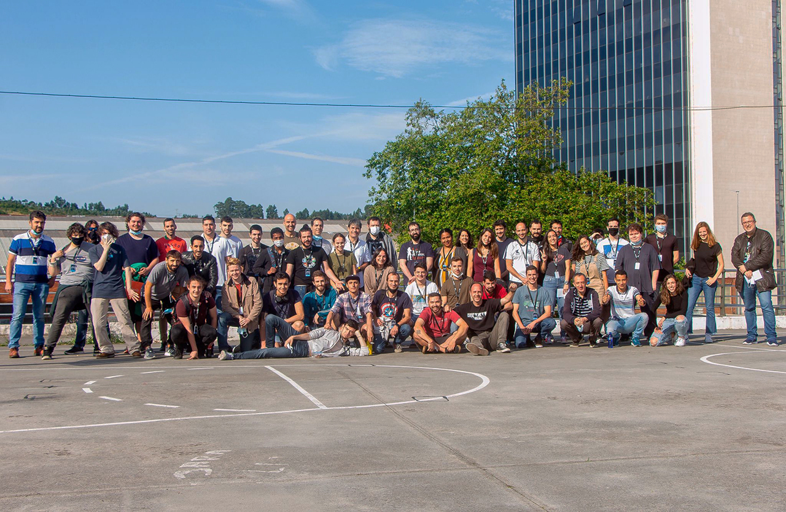

<h1 align="center">
	🏊 C Piscine @ 42 Urduliz
</h1>

	<b><i>MY WORK DEVELOPED DURING C PISCINE AT 42 URDULIZ</i></b> 

	
	
	
	
	

<h3 align="center">
	<a href="#%EF%B8%8F-about">About 42</a>
	 · 
	<a href="#%EF%B8%8F-skills-developed-at-c-piscine">Skills</a>
	 · 
	<a href="#fulfilled-projects">Projects</a>
</h3>

---

This is my coding work developed during my Piscine experience at [42Urduliz](https://www.42urduliz.com/) School, from 07/Jun/21 to 02/Jul/21.

## About

	42 is a private, nonprofit and tuition-free computer programming school that proposes a new
	way of learning: no teachers, no books, students learning one from others (peer to peer learning),
	with a methodology that develops both computing and life skills.
	The "C Piscine" is a 26-day C programming bootcamp, and the last stage in the selection process
	for becoming a 42's student.

## Skills developed at C Piscine

### Hard-skills
	# C Language
		The primary language learned at the 42's Piscine is C: dealing with variables,
		pointers, memory allocation, macros, as well as creating functions and programs,
		including the use and creation of libraries and Makefiles.

	# Shell
		The first two days are dedicated to learning basic to intermediate
		shell commands to seamlessly navigate through the terminal.

	# Git
		All projects are submitted via a remote git repository, which demands students to
		be at ease with such a system.

### Soft-skills
	# Self-learning and proactiveness
		At 42, self-learning is at the core of its peer to peer learning methodology. There
		are no teachers; the learning process is based on googling, enquiring
		your classmates, and empirical knowledge, each student learning at their own pace.

	# Teamwork
		On weekends, a 48h team project called "Rush" is proposed: a 3-member group randomly
		chosen by the school's system must collaboratively develop a fully running application.
		The major challenge here is to equalize the different knowledge levels while finding a
		common work methodology that allows all team members to contribute to the project.

	# Time management and resiliency
		The "pisciners" are free to work whenever they want, which demands excellent
    	time management skills and resiliency for not "drowning" amid the massive load
    	of work demanded by the non-stop 26-day program.
	
------

## :camera: My 42 Piscine Intra Profile

## Fulfilled projects

The table below show the projects that I have carried out during my C Piscine in chronological order.

|#	|SUBJECT			|LANGUAGE	|DURATION		|EXPERIENCE	|STATUS				|ATTAINED LEVEL	|
|:-:    |:--				|:-:		|--:			|--:		|--:				|:--		|
|01	|[Shell 00](./shell00)		|Shell		|2 days			|100 XP		|100% :heavy_check_mark:	|level 0 - 88%	|
|02	|[Shell 01](./shell01)		|Shell		|2 days			|100 XP		|85% :heavy_check_mark:		|level 1 - 55%	|
|03	|Exam 00			|C		|<10 minutes		|225 XP		|0% :x:				|-             	|
|04	|[C 00](./c00)			|C		|2 days			|100 XP		|85% :heavy_check_mark:		|level 2 - 13%	|
|05	|[Rush 00](./rush00)		|C		|2 days			|150 XP		|120% :heavy_check_mark:	|level 3 - 32%	|
|06	|[C 01](./c01)			|C		|1 day			|100 XP		|100% :heavy_check_mark:	|level 3 - 98%	|
|07	|Exam 01			|C		|about 1 hour		|225 XP		|0% :x:				|-            	|
|08	|[Rush 01](./rush01)		|C		|2 days			|150 XP		|0% :x:				|-		|
|09	|[C 02](./c02)			|C		|2 days			|100 XP		|65% :heavy_check_mark:		|level 4 - 32%	|
|10	|[C 03](./c03)			|C		|2 days			|100 XP		|75% :heavy_check_mark:		|level 4 - 72%	|
|11	|Exam 02			|C		|4 hours		|225 XP		|28% :heavy_check_mark:		|level 5 - 04%	|
|12	|[Rush 02](./rush02)		|C		|2 days			|150 XP		|0% :x:				|-		|
|13	|[C 04](./c04)			|C		|2 days			|100 XP		|70% :heavy_check_mark:		|level 5 - 37%	|
|14	|[C 06](./c06)			|C		|1 day			|100 XP		|70% :heavy_check_mark:		|level 5 - 70%	|
|15	|[C 05](./c05)			|C		|2 days			|100 XP		|75% :heavy_check_mark:		|level 6 - 05%	|
|16	|[BSQ](./bsq)			|C		|4 days			|225 XP		|0% :x:				|-          	|
|17	|Final Exam			|C		|about 8 hours		|375 XP		|48% :heavy_check_mark:		|level 6 - 79%	|
